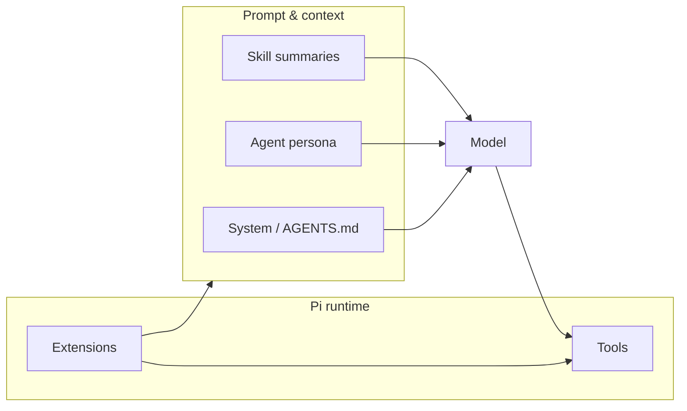

# Skills, agents, extensions, and tools

This document is a **single map** of four Pi concepts that are easy to confuse. Each has its own deep dive elsewhere; here the focus is **what it is**, **what it runs as**, and **how it relates to the others.

---

## 1. One-line definitions

| Concept | One line | Implemented as |
|--------|-----------|----------------|
| **Tool** | A **named capability** the model can invoke (read a file, run a command, call a custom function). | Built into Pi and/or registered by **extensions**; described to the model as a **schema**. |
| **Extension** | **TypeScript** loaded by Pi that can attach **hooks**, **slash commands**, **extra tools**, and **UI**. | `export default function (pi: ExtensionAPI) { … }` in `.ts` files. |
| **Agent** | A **persona**: system prompt + metadata (often a **subset of tools**) used by orchestration or `/system`. | Markdown with YAML frontmatter (e.g. `.pi/agents/*.md`). |
| **Skill** | **On-disk instructions** (workflows, checklists) surfaced by description; full text loaded **on demand**. | `SKILL.md` under `.pi/skills/<name>/` (and other discovery paths). |

---

## 2. How they differ (the important distinctions)

### 2.1 Tools vs everything else

- **Tools** are the **only** thing the model **calls** in the structured “tool use” sense (function name + arguments → result).
- **Extensions** may **define** new tools (`pi.registerTool`) or change behavior around existing ones (e.g. auditing before bash).
- **Agents** do not add tools by themselves; they **restrict or describe** which tools a **spawned** or **selected** session may use (`tools:` in frontmatter, where supported).
- **Skills** do not register tools; they **tell the model how to use** tools (e.g. “run `playwright-cli` via bash”) when the model follows the skill text.

### 2.2 Extensions vs agents vs skills

| | **Extension** | **Agent** | **Skill** |
|---|----------------|-----------|-----------|
| **Language** | TypeScript | Markdown + frontmatter | Markdown + frontmatter |
| **Runs code?** | Yes (your logic in-process) | No (text prompt only) | No (instructions only; optional scripts *you* run) |
| **Typical purpose** | Commands, hooks, custom tools, TUI | Persona, role, tool allowlist for a session | Repeatable workflow doc |
| **Loaded** | At Pi startup / `pi -e` / settings | Scanned from disk when an extension lists agents | Discovered at startup; full file on demand |

### 2.3 Mental model

- The **model** chooses **tools** from what Pi exposes for that session.
- **Skills** and **agent text** shape *what* the model tries to do; **extensions** shape *what exists* (tools, commands, hooks).

---

## 3. When to use which

| Goal | Use |
|------|-----|
| Add a new **API** the model can call (DB query, deploy, internal CLI) | **Extension** → `registerTool` |
| Add **`/mycommand`** or a footer widget | **Extension** |
| Define a **planner** or **reviewer** persona with limited tools | **Agent** + **`system-select`** or **`agent-team`** / **`agent-chain`** |
| Document a **repeatable procedure** (testing flow, release checklist) | **Skill** (`SKILL.md`) |
| Just edit files and run shell—no new capability | Built-in **tools** only (`read`, `write`, `edit`, `bash`, …) |

---

## 4. Where to read more (this repo)

| Concept | Doc |
|--------|-----|
| **Tools** | **[TOOLS.md](TOOLS.md)** (guide); root **[TOOLS.md](../TOOLS.md)** (TypeScript-style signatures) |
| **Extensions** | **[EXTENSIONS.md](EXTENSIONS.md)** |
| **Agents** | **[AGENTS.md](AGENTS.md)**, **[AGENT_TEAMS.md](AGENT_TEAMS.md)** |
| **Skills** | **[SKILLS.md](SKILLS.md)** |
| **Memory vs files** | **[AGENT_MEMORY.md](AGENT_MEMORY.md)** |
| **Big picture** | **[SYSTEM.md](SYSTEM.md)** |

---

## 5. Quick confusion fixes

| Misconception | Correction |
|---------------|------------|
| “This skill adds a `grep` tool.” | Skills **don’t** register tools; they **instruct** use of tools Pi already exposes. |
| “Agents are mini-extensions.” | Agents are **prompt + metadata**; extensions are **code**. |
| “Extensions replace skills.” | Extensions **change runtime**; skills **document workflows**—often both are useful. |
| “Everything the model does is a tool.” | **Plain assistant text** is not a tool call; **tool calls** are the structured invocations Pi executes. |
