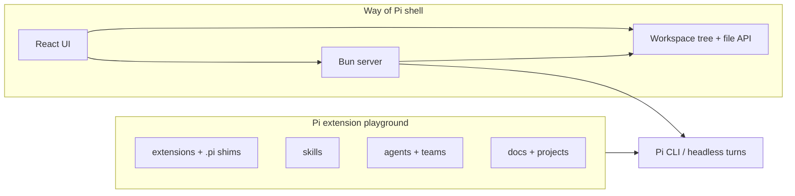

# Way of Pi — product overview

**Purpose:** A short **onboarding narrative** for what this repository is, who it is for, and how the pieces fit together. For a **feature-by-feature status table** (shipped vs partial vs planned), use **[WOP_PRODUCT_CAPABILITIES.md](WOP_PRODUCT_CAPABILITIES.md)**.

**Repository:** [github.com/zerwiz/wayofpi](https://github.com/zerwiz/wayofpi)

**Last updated:** 2026-04-11

---

## 1. One-sentence pitch

**Way of Pi** is a **desktop-first web shell** around your **project workspace**—editor, files, chat, and optional terminal—while this repo’s **Pi extension playground** remains the **authoritative customization layer** for **[Pi Coding Agent](https://github.com/mariozechner/pi-coding-agent)** (extensions, skills, agents, teams).

---

## 2. Why it exists

Many power users already live in **Pi’s TUI**: fast, scriptable, and rich with **`extensions[]`**, **tools**, and **multi-agent** flows. A **graphical shell** lowers the barrier for editing, browsing trees, and managing models—without inventing a second agent engine in the server. The product direction is **maximize Pi as backend** (see **[WOP_PI_BACKEND_WIRING_PLAN.md](WOP_PI_BACKEND_WIRING_PLAN.md)** and **`.cursor/rules/wop-ui-pi-backend-parity.mdc`**): Way of Pi owns **host I/O** and **wiring**; **Pi** owns **agent behavior** end-to-end.

---

## 3. What ships in this repo (conceptual map)

| Piece | You get |
|-------|---------|
| **Playground** | Experiment with **TypeScript extensions**, **`.pi/settings.json`**, **skills**, **`.pi/agents`**, **`teams.yaml`**, **`just` / `ppi`** recipes, and **`projects/<slug>/`** notes—same concepts as upstream Pi. |
| **Shell (`apps/wayofpi-ui`)** | **Electron** (recommended) or **browser** dev: **Simple** chat-first UI or **Technical** IDE-style layout (multi-pane grid, docks), **workspace-scoped** file operations, **WebSocket** chat, diagnostics, and controls that align with **`WOP_*`** isolation (**[WOP_NAMESPACE.md](WOP_NAMESPACE.md)**). |

---

## 4. Typical journeys

1. **Customize Pi in the terminal** — Clone or open this repo, run **`just pi`** / **`ppi pi`**, edit **`extensions/`** and **`.pi/`**, use **`/reload`** in Pi. Deep guides: **[EXTENSIONS.md](EXTENSIONS.md)**, **[AGENTS.md](AGENTS.md)**, **[SKILLS.md](SKILLS.md)**.
2. **Work on another codebase in the GUI** — Start **`./start-wayofpi-electron.sh`** or **`./start-wayofpi-ui.sh`**, **open a folder** as the workspace (that folder is the scope for **`/api/file`**, tree, and Pi **cwd**—not “whatever tab is open”). **[apps/wayofpi-ui/README.md](../apps/wayofpi-ui/README.md)**.
3. **Plan shipping Way of Pi as a product** — Read the **namespace and headless Pi** plan (**[WOP_STANDALONE_SYSTEM_PLAN.md](WOP_STANDALONE_SYSTEM_PLAN.md)**), the **API and WebSocket wiring** map (**[WOP_PI_BACKEND_WIRING_PLAN.md](WOP_PI_BACKEND_WIRING_PLAN.md)**), and the **open backlog** (**[WOP_OPEN_TODOS.md](WOP_OPEN_TODOS.md)**).

---

## 5. Relationship to other docs

| If you need… | Read… |
|--------------|--------|
| **Status matrix** (what is shipped vs interim) | **[WOP_PRODUCT_CAPABILITIES.md](WOP_PRODUCT_CAPABILITIES.md)** |
| **Full product / MVP / isolation** (long-form) | **[WOP_STANDALONE_SYSTEM_PLAN.md](WOP_STANDALONE_SYSTEM_PLAN.md)** |
| **All roadmap links** | **[WOP_PLANNING.md](WOP_PLANNING.md)** |
| **Repo layout** | **[REPO_INDEX.md](REPO_INDEX.md)** |
| **Shell components** (grid, panes, persistence) | **[WOP_TECHNICAL_UI.md](WOP_TECHNICAL_UI.md)** |
| **Boot, ports, scripts** | Root **[README.md](../README.md)**, **[apps/wayofpi-ui/README.md](../apps/wayofpi-ui/README.md)** |

---

## 6. Maintenance

When the **positioning** of the product changes (for example, default chat engine or major UI mode), update this overview in the same pass as **[WOP_PRODUCT_CAPABILITIES.md](WOP_PRODUCT_CAPABILITIES.md)** and the **Way of Pi** bullets in root **[README.md](../README.md)** so newcomers do not drift across three stories.
