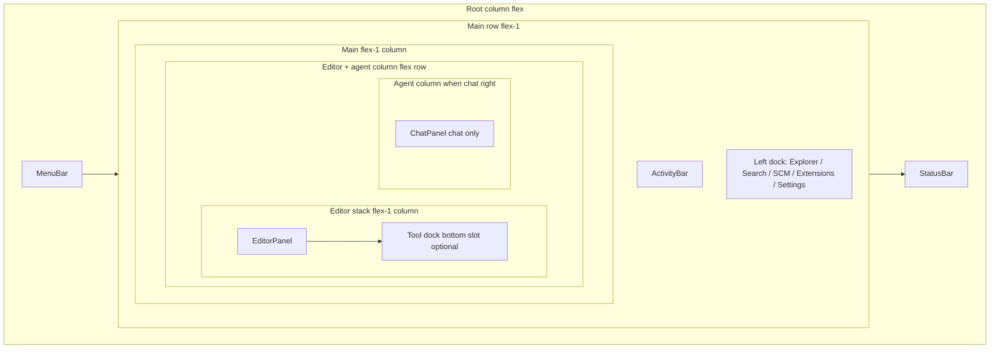

# Way of Pi — technical UI (architecture)

This document describes the **IDE-style technical shell** in `apps/wayofpi-ui`: **dock regions** and the **strips** (tab bars + bodies) hosted in them, plus the Bun-backed client.

**Modular dock vision + phased TODO plan:** **[WOP_MODULAR_DOCKS_PLAN.md](WOP_MODULAR_DOCKS_PLAN.md)** (parity, N strips, movable agent/sidebar, layout graph). **Cursor rule** for agents working in the UI tree: **[`.cursor/rules/wop-ui-modular-docks.mdc`](../.cursor/rules/wop-ui-modular-docks.mdc)**.

For product scope and roadmap, see **[PLAN_WEB_STANDALONE_SYSTEM.md](PLAN_WEB_STANDALONE_SYSTEM.md)**. For Explorer parity with common IDE trees, see **[IDE_EXPLORER_PARITY.md](IDE_EXPLORER_PARITY.md)**. For **generated/binary files**, **Cursor/Zed-style** repo conventions, and **line-number parity** with docs, see **[WOP_GENERATED_FILES_AND_LINE_PARITY.md](WOP_GENERATED_FILES_AND_LINE_PARITY.md)**. For **menu bar / command coverage**, see **[WOP_MENU_BAR_BACKLOG.md](WOP_MENU_BAR_BACKLOG.md)**. For run/setup and API tables, see **`apps/wayofpi-ui/README.md`**.

## Unified horizontal docks — plan (shipped baseline + next)

**Intent:** One **horizontal tool/file dock** at the **bottom of the editor stack** only (**`UnifiedHorizontalDock`** `slot="bottom"` + **`DockableToolStrip`**). The **upper** band under the menu was **removed**; legacy `strips.top` is **folded into `strips.bottom`** on load/save (`collapseTopToolDockIntoBottom` in **`technicalLayoutStorage.ts`**). Height is **`TechnicalDockLayout.horizontalToolDockHeightsPx.bottom`** (the `top` key is still clamped when reading/writing layout JSON for backward compatibility but is unused in the UI). When the agent is docked **right**, the dock does **not** sit under the agent. The **agent column** is **chat-only**. **Drag-and-drop** reorders entries in the **bottom** strip (the `top` zone in types normalizes to **`bottom`** for all mutations).

**Product target** (movable agent, N strips, sidebar edge, full parity): see **[WOP_MODULAR_DOCKS_PLAN.md](WOP_MODULAR_DOCKS_PLAN.md)** — this section stays the **as-built** summary.

### Shipped (current code)

| Item | Detail |
|------|--------|
| **Slots** | **UI:** **`bottom`** only (under editor stack). **Types** still use **`HorizontalToolDockSlot`**: `strips.top` is kept **empty**; **`top`** is normalized to **`bottom`** on all mutations. Legacy **`right`** / **`middle`** / **`top`** panel zones migrate to **`bottom`**. |
| **Chrome** | **`UnifiedHorizontalDock`** (`slot="bottom"`): **`DockRegionTitleBar`** + **`DockableToolStrip`**. **+** adds **Files** and **Panels** into the bottom strip. |
| **Strip model** | **`ToolDockLayout.strips.bottom`**: ordered **`DockStripEntry`**. **`activeIndexBySlot.bottom`**. On read/write, **`collapseTopToolDockIntoBottom`** merges any legacy **`strips.top`** into **`bottom`** (deduped). |
| **File body in strip** | **`StripFilePreview`**: read-only **`GET /api/file`** for `file` entries; activating a file tab can set **`selectedPath`** for the main editor. |
| **Defaults** | **`TechnicalDockLayout`**: `horizontalToolDockHeightsPx: { top: 280, bottom: 140 }` (`readDockLayout` / `wayofpi.technical.dockLayout`). Legacy JSON keys `topPanelHeightPx` / `bottomPanelHeightPx` are still read on load. |
| **Default tools** | **`ToolDockLayout`**: **terminal + output** → **`top`**; **problems + tool_log** → **`bottom`** (defaults in **`technicalLayoutStorage`**). |
| **Migration** | Legacy **`middle`** → **`top`**; legacy **`right`** (tools under agent) → **`bottom`**. Removed: **`bandOrderTopMiddle`**, **`middlePanelHeightPx`**, **`bottomToolStripAttach`**, **`rightChatToolsCollapsed`**, **`rightToolStripHeightPx`**, **`rightToolColumnWidthPx`**, **`rightActiveTab`**. |
| **Removed UI** | **`TechnicalDockPanelFrame`** (“Workspace document” / “Agent session” title rows) — center editor and chat use a simple bordered container. **`DockBandHandle`** (swap top/middle) deleted. **Terminal “Play”** strip button removed in favor of **+** / focus commands. |
| **DnD reliability** | **`dataTransferHasType`** (`utils/dataTransferTypes.ts`) — `DataTransfer.types` is not always an array with `.includes`. Strip payload: **`application/x-wop-dockstrip-entry`** (JSON **`DockStripEntry`**). |
| **Toggles** | Status bar + command palette + menus: one visibility flag per slot (`horizontalToolDockVisible` in `App.tsx`). Bands can show **empty** ( **+** only ) when visible. |

### Next (not shipped)

| Item | Detail |
|------|--------|
| **Visual parity** | Editor tab row vs dock tab row should feel **equal** (single chrome row, matching styles) — **Phase A** in **[WOP_MODULAR_DOCKS_PLAN.md](WOP_MODULAR_DOCKS_PLAN.md)**. |
| **File strip = editor-class** | Optional **`WorkspaceTextBuffer`** read-only + breadcrumbs in strip — **Phase B** in same plan. |
| **N strips / layout graph** | More than two horizontal strips, side-by-side stacks, persisted **`DockStripInstance[]`** — **Phase C**. |
| **Movable agent + sidebar** | Agent **left**; primary sidebar **right**; data-driven region order — **Phase D**. |
| **Full pane grid** | Multi-column editor, split drop targets — **Phase E**; see **[PLAN_WEB_STANDALONE_SYSTEM.md](PLAN_WEB_STANDALONE_SYSTEM.md)**. |

---

## Target: one strip model for files and tools (movable between docks)

**Shipped baseline:** **`DockStripEntry`** unifies **tool** and **file** tabs; two zones **`top` \| `bottom`**; DnD between zones; file body is **`StripFilePreview`** (read-only), not full **`EditorPanel`**.

**Long-term goal (modular shell):** Treat **major regions** (editor stack, strips, agent, primary sidebar) as **docks** in a **layout graph**; support **N** strips, **movable agent** (e.g. left), **sidebar on right**, and **editor splits**. Roadmap and checklists: **[WOP_MODULAR_DOCKS_PLAN.md](WOP_MODULAR_DOCKS_PLAN.md)**.

| | Today (`App.tsx`) | Target |
|---|-------------------|--------|
| **Tool + file strips** | **`DockStripEntry[]`** per **`top` / `bottom`**; DnD; **`activeIndexBySlot`**. | **N** strip instances; optional side-by-side strips; same entry model. |
| **Open files (main)** | Single **`selectedPath`** + one **`EditorPanel`** in the center band. | Multi-column / split editors; optional: open file list as first-class layout nodes. |
| **File in strip** | Read-only preview + “open in main” via tab activation. | Optional **`WorkspaceTextBuffer`** parity, explicit **Open in main editor** — **Phase B** in plan doc. |
| **Persistence** | **`toolDock`** + **`dockLayout`** + ephemeral **`selectedPath`**. | Merged **layout graph**, optional per-workspace — **Phases C–E**. |

**Implementation types (shipped names in code):**

```ts
// apps/wayofpi-ui/src/utils/technicalLayoutStorage.ts
type DockStripEntry =
  | { type: "tool"; id: ToolPanelId }
  | { type: "file"; path: string };

type ToolPanelZone = "top" | "bottom"; // placement keys today; generalize in Phase C
```

## Scope

| Surface | Location | Notes |
|---------|----------|--------|
| **Technical UI** | `src/App.tsx` when `useUiMode().mode === "technical"` | **Dock layout**: activity + left activities, **upper** tool band (full `main` width), **center row** = editor stack (with **lower** tool band under the editor only) + optional **`ChatPanel`** when docked **right**, **`ChatPanel`** (right or bottom), status bar. |
| **Simple UI** | `src/components/simple/SimpleApp.tsx` | Chat-forward layout; shares hooks and tree/file/session state with `App`. **`App.tsx`** owns **`simpleTab`** and **`CommandPalette`** for Simple mode. Not detailed further here. |

Both modes share **`useWorkspaceTree`**, **`useFileEditor`**, **`useWayOfPiSession`**, and **`useServerConfig`** instantiated in `App.tsx`.

## Runtime topology

- **Vite dev server** (e.g. `:5173`) serves the React app and **proxies** `/api` and `/ws` to the Bun backend (`vite.config.ts`).
- **Bun server** (default `:3333`) implements REST + WebSocket; in production the same process can serve `dist/` static assets.

The browser always calls **relative** URLs (`/api/...`, `/ws`), so the UI does not hard-code the API port in client code.

## Top-level layout (technical)



- **Root container**: `data-ui-mode`, `wop-density-compact`, VS Code–like palette (`#1e1e1e` background, **`#ea580c` focus accents** — warm orange instead of default blue).
- **Left dock** is chosen by `TechnicalActivity` (see below); width comes from **`dockLayout.leftSidebarWidthPx`**.
- **Tool strip** today: one **`UnifiedHorizontalDock`** (**`bottom`** only, under **`EditorPanel`**). **Mixed** **`DockStripEntry`** (tools + optional pinned files); see § *Unified horizontal docks*.

### Primary sidebar visibility (common IDE pattern)

Many editor shells toggle the **primary sidebar** (activity bar + Explorer / Search / SCM views) with **Ctrl/Cmd+B** so the editor can use full width; focus commands bring views back.

Way of Pi technical UI mirrors that idea:

| Control | Behavior |
|---------|----------|
| **View → Hide / Show primary sidebar** | Toggles **both** the **`ActivityBar`** and the **left panel** (Explorer, Search, SCM, Extensions, Settings). |
| **Ctrl/Cmd+B** | Same toggle (**technical** mode only; avoids fighting Simple mode). |
| **Command palette** | “View: Hide primary sidebar” / “View: Show primary sidebar”. |
| **Sliver button** | When hidden, a narrow strip with a **panel** icon at the far left restores the sidebar (same as clicking “Show”). |
| **Show Explorer / Search / …** | Any **View** or palette action that opens an activity also **shows** the sidebar if it was hidden. |

Persistence: **`localStorage`** key **`wayofpi.technical.leftSidebarVisible`** (`"1"` / `"0"`). Implemented in **`src/utils/technicalLayoutStorage.ts`**.

### Agent / session dock (subset of full pane-grid shells)

Full-featured shells use a **pane grid**: editors, terminals, and auxiliary views in **dock regions**, often with **draggable tabs**, **splits**, and **splitters**, plus a **bottom panel** and **secondary sidebar** (e.g. for session chat) — layout often persisted per workspace.

Way of Pi does **not** implement arbitrary tab drag-and-drop or N-way splits yet. The technical UI implements a **small, explicit subset** that matches common expectations:

| Capability | Behavior |
|------------|----------|
| **Dock region** | Session / agent chat (**`ChatPanel`**) docks **to the right** (secondary sidebar) or **along the bottom** (below the editor stack and **lower** tool band). |
| **Resize** | **`DockSplitHandle`** splitters: vertical handle between editor stack and right chat; horizontal handle between editor stack and bottom-docked chat; horizontal handles on each tool-dock band. |
| **Hide / show** | Header buttons on **`ChatPanel`** (dock icons + hide) and **View** menu + command palette. When hidden, a slim **Agents** strip on the right restores the panel. |
| **Persistence** | **`localStorage`** key **`wayofpi.technical.dockLayout`** — agent geometry, sidebar width, **`horizontalToolDockHeightsPx`**. Helpers in **`src/utils/technicalLayoutStorage.ts`**. |

**Roadmap:** unify **file** and **tool** tabs (this doc § Target); then optional workspace-specific layout, splits, and Zed-like **zoom** — see **[PLAN_WEB_STANDALONE_SYSTEM.md](PLAN_WEB_STANDALONE_SYSTEM.md)** and **[WAY_OF_PI_OPEN_TODOS.md](WAY_OF_PI_OPEN_TODOS.md)**.

## Types and navigation

Defined in **`src/types/technicalShell.ts`** and **`src/utils/technicalLayoutStorage.ts`**:

- **`TechnicalActivity`**: `"explorer" | "search" | "scm" | "extensions" | "planning" | "settings"` — drives the left dock content and **`ActivityBar`** selection.
- **`BottomPanelTab`** (tool ids in menus / **`ToolPanelBody`**): `"problems" | "output" | "tool_log" | "terminal"`. Strip persistence uses **`DockStripEntry`** (`tool` \| `file`).
- **`ToolPanelZone`** (= **`HorizontalToolDockSlot`**): `"top" | "bottom"` — which **slot** hosts a strip; **`ToolDockLayout`** persists **`strips`**, derived **`panels`** visibility/order for tools, and **`activeIndexBySlot`** (legacy **`activeTabBySlot`** in JSON is migrated on read).

## Component responsibilities

| Component | File | Role |
|-----------|------|------|
| **MenuBar** | `components/MenuBar.tsx` | File/workspace actions, UI mode toggle (Simple/Technical), **primary sidebar** toggle (technical), **agent panel** dock (right/bottom) and visibility (technical), activity shortcuts, command palette trigger. **`horizontalToolDockToggles`** drives **upper** / **lower** band visibility in View / Terminal menus. |
| **CommandPalette** | `components/CommandPalette.tsx` | Modal command list; items are built in `App.tsx` (`commandItems`). |
| **ActivityBar** | `components/ActivityBar.tsx` | Maps each `TechnicalActivity` to an icon button; active indicator strip. |
| **ExplorerSidebar** | `components/ExplorerSidebar.tsx` | Explorer header, collapsible workspace folder section, new file/folder toolbar, **`FileTree`**, Outline/Timeline placeholders. |
| **FileTree** | `components/FileTree.tsx` | Recursive tree; expand/collapse; folders-first sort via **`sortTreeNodes`**; optional `expandRevision` / `pathsToExpand` to open ancestors after create. |
| **SearchSidePanel** | `components/TechnicalSidePanels.tsx` | Flat file list filtered by path substring (`flattenTreeFiles`). |
| **ScmSidePanel** | `components/TechnicalSidePanels.tsx` | SCM placeholder / refresh hook. |
| **ExtensionsSidePanel** | `components/TechnicalSidePanels.tsx` | Extensions placeholder. |
| **SettingsSidePanel** | `components/TechnicalSidePanels.tsx` | Shows server config / workspace path. |
| **EditorPanel** | `components/EditorPanel.tsx` | Text buffer UI, save, dirty state, cursor reporting. |
| **ChatPanel** | `components/ChatPanel.tsx` | Session / agent chat; **docked** right or bottom via **`technicalDock`**; dock toolbar (**PanelRight** / **PanelBottom** / hide); transcript, send/stop, **New session**. **Team Pulse** tab: roster grid aligned with Pi TUI **`agent-team`** cards ([`AgentTeamPulseGrid.tsx`](../apps/wayofpi-ui/src/components/AgentTeamPulseGrid.tsx)) — data from **`/api/agents`** `teams` + agent `.md` descriptions; live run/stream state is **[WOP_MULTI_AGENT_WEBSOCKET.md](WOP_MULTI_AGENT_WEBSOCKET.md)**. |
| **DockSplitHandle** | `components/DockSplitHandle.tsx` | Pointer-driven splitters between dock regions (resize). |
| **UnifiedHorizontalDock** | `components/UnifiedHorizontalDock.tsx` | **Single** dock-band shell (`slot`: upper \| lower): title row + **`DockableToolStrip`**. |
| **DockableToolStrip** | `components/DockableToolStrip.tsx` | Tab bar + **+** menu; drag reorder / move **tool and file** entries between **`top` / `bottom`**; hosts **`ToolPanelBody`** or **`StripFilePreview`**. |
| **StripFilePreview** | `components/StripFilePreview.tsx` | Read-only file body for **`file`** strip entries. |
| **ToolPanelBody** | `components/ToolPanelBody.tsx` | Content for Problems / Output / Tool log / Terminal inside a strip. |
| **DockRegionTitleBar** | `components/DockRegionTitleBar.tsx` | Shared chrome for docked regions. |
| **BottomPanel** | `components/BottomPanel.tsx` | Standalone tabbed strip component (simpler than **`DockableToolStrip`**); **not** the primary technical-shell host—**`App.tsx`** uses **`DockableToolStrip`**. |
| **StatusBar** | `components/StatusBar.tsx` | **Zed-style** icon cluster (project / terminal / plan / chat / search / Git / diagnostics / check), **`horizontalDockStrip`** toggles per tool-dock **slot**, tool tabs, connection (**Activity**), workspace path; right: diagnostics badge, **Settings**, **Sparkles** (agent), line/col/language. Behaviour aligned with [Zed visual customization](https://zed.dev/docs/visual-customization) status bar panel buttons (`project_panel`, `terminal`, `agent`, `search`, `git_panel`, `diagnostics`, etc.). |

Supporting utilities:

- **`src/utils/sortTreeNodes.ts`** — directory-first tree ordering.
- **`src/utils/posixPath.ts`** — `posixDirname`, `ancestorDirPaths` (browser-safe, workspace paths use `/`).
- **`src/utils/flattenTree.ts`** — used by search (and Simple mode file list helpers).

## State coordination (`App.tsx`)

`App` is the **single coordinator** for technical mode:

| State | Purpose |
|-------|---------|
| `selectedPath` | Open file path (relative to workspace); feeds **`useFileEditor`**. |
| `explorerContextDir` | Target folder for **New File** / **New Folder**; updated when selecting a file (parent dir) or clicking a directory in the tree. |
| `treeExpand` | `{ rev, paths }` to force-expand folder paths after creating a file/folder. |
| `activity` | Current **`TechnicalActivity`** (left panel). |
| `leftSidebarVisible` | **Technical:** activity bar + left panel visible; persisted via **`technicalLayoutStorage`**. |
| `commandPaletteOpen` | Command palette visibility. |
| `horizontalToolDockVisible` | Per-slot visibility for **upper** / **lower** tool-dock bands (same system; splitters are part of each band’s block in the tree). |
| `toolDock` | **`ToolDockLayout`**: **`strips`** (**`DockStripEntry[]`** per slot), **`activeIndexBySlot`**, derived **`panels`** for tools; persisted as **`wayofpi.technical.toolDock`**. |
| `dockLayout` | **`TechnicalDockLayout`**: agent dock, sidebar width, **`horizontalToolDockHeightsPx`**; persisted as **`wayofpi.technical.dockLayout`**. |
| `simpleTab` | Simple UI only: active **`SimpleTabId`** for the left nav rail (lifted in **`App.tsx`**). |
| `line`, `col` | Cursor position from **`EditorPanel`** for **`StatusBar`**. |

**Keyboard (window-level):**

- **Ctrl/Cmd+K** — open command palette (both modes: Technical = full IDE commands; Simple = tabs + save/refresh + per-file **Open:** entries).
- **Ctrl/Cmd+S** — save current file and refresh tree (both modes).
- **Ctrl/Cmd+B** — toggle **primary sidebar** (**technical** mode only).

## Data hooks

| Hook | File | Data source | Notes |
|------|------|-------------|--------|
| **useUiMode** | `hooks/useUiMode.ts` | `localStorage` key `wayofpi.uiMode` | `simple` \| `technical`. |
| **useWorkspaceTree** | `hooks/useWorkspaceTree.ts` | `GET /api/tree` | `root`, `nodes` (`TreeNode[]`), `refresh()`. |
| **useFileEditor** | `hooks/useFileEditor.ts` | `GET/PUT /api/file` | Loads/saves text; 2 MiB cap enforced server-side. |
| **useServerConfig** | `hooks/useServerConfig.ts` | `GET /api/config` | Provider/model labels for UI. |
| **useWayOfPiSession** | `hooks/useWayOfPiSession.ts` | WebSocket `/ws` | Chat rows, streaming flag, server log lines; optional tree refresh callback. |

**Create file/folder** uses **`apiPostJson("/api/fs/entry", { path, kind })`** (see server and **`apps/wayofpi-ui/README.md`**).

## Tree and file types

**`src/types/tree.ts`** defines **`TreeNode`** (name, path, `dir` \| `file`, optional `children`, optional `gitStatus`). The server builds the tree in **`server/tree.ts`** with jail under **`WOP_WORKSPACE`** (**`server/paths.ts`**).

## Styling conventions

- **Tailwind** utility classes throughout; no separate design-token file yet.
- Technical shell mimics **Dark+** style: grays `#252526`, `#2d2d2d`, `#3c3c3c` borders; blue `#007acc` for focus/active.
- **`ChatPanel`** and tool bodies receive **`uiMode`** where shared components adjust density or copy.

## Adding a feature (checklist)

1. **Server** — If new persistence or tools: extend **`server/index.ts`** (and **`paths.ts`** if path rules change). Document the route in **`apps/wayofpi-ui/README.md`**.
2. **Client API** — Add helpers in **`src/api/client.ts`** if needed.
3. **Hook** — Prefer a dedicated hook if the feature has subscription/lifecycle (mirror **`useWorkspaceTree`**).
4. **UI** — New side activity: extend **`TechnicalActivity`** and **`ActivityBar` ITEMS**, add a panel branch in `App.tsx` `leftPanel`, and register commands in **`commandItems`**.
5. **Docs** — Update this file or **`IDE_EXPLORER_PARITY.md`** if behavior is user-visible against IDE expectations.

## Related documentation

| Doc | Use |
|-----|-----|
| **[IDE_EXPLORER_PARITY.md](IDE_EXPLORER_PARITY.md)** | Explorer UX vs Cursor/Zed. |
| **[PLAN_WEB_STANDALONE_SYSTEM.md](PLAN_WEB_STANDALONE_SYSTEM.md)** | Product plan, phases, production. |
| **[WAY_OF_PI_OPEN_TODOS.md](WAY_OF_PI_OPEN_TODOS.md)** | Known gaps and stubs. |
| **[WOP_MODULAR_DOCKS_PLAN.md](WOP_MODULAR_DOCKS_PLAN.md)** | Modular dock TODO: parity, N strips, movable agent/sidebar, phases. |
| **[`.cursor/rules/wop-ui-modular-docks.mdc`](../.cursor/rules/wop-ui-modular-docks.mdc)** | Agent rule when editing **`apps/wayofpi-ui`**. |
| **`apps/wayofpi-ui/README.md`** | Commands, env vars, API table, WebSocket summary. |
