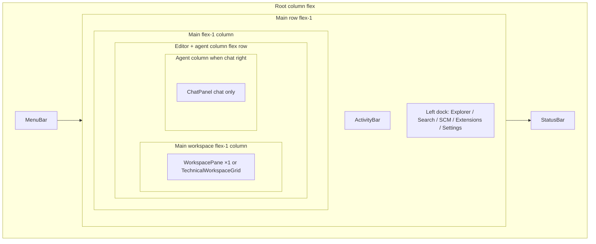

# Way of Pi — technical UI (architecture)

This document describes the **IDE-style technical shell** in `apps/wayofpi-ui`: **dock regions** and the **strips** (tab bars + bodies) hosted in them, plus the Bun-backed client.

**Modular dock vision + phased TODO plan:** **[WOP_MODULAR_DOCKS_PLAN.md](WOP_MODULAR_DOCKS_PLAN.md)** (parity, N strips, movable agent/sidebar, layout graph). **Cursor rule** for agents working in the UI tree: **[`.cursor/rules/wop-ui-modular-docks.mdc`](../.cursor/rules/wop-ui-modular-docks.mdc)**.

For product scope and roadmap, see **[WOP_STANDALONE_SYSTEM_PLAN.md](WOP_STANDALONE_SYSTEM_PLAN.md)**.

**CRITICAL — Pi backend:** Chat and **agent tools/extensions** must eventually run through **headless Pi** (`WOP_PI_BINARY`), not only Bun/Ollama prompts — see **[WOP_PI_BACKEND_WIRING_PLAN.md](WOP_PI_BACKEND_WIRING_PLAN.md)** §0 and **`.cursor/rules/wop-ui-pi-backend-parity.mdc`**. **`apps/wayofpi-ui/server/pi-agent-runtime.ts`** routes **`WOP_CHAT_ENGINE=pi`** / **`auto`** through **`pi --mode json`** when the CLI resolves (full Pi tools for all personas; long-lived Pi + **`/ws`** tunnel still planned). For Explorer parity with common IDE trees, see **[IDE_EXPLORER_PARITY.md](IDE_EXPLORER_PARITY.md)**. For **generated/binary files**, **Cursor/Zed-style** repo conventions, and **line-number parity** with docs, see **[WOP_GENERATED_FILES_AND_LINE_PARITY.md](WOP_GENERATED_FILES_AND_LINE_PARITY.md)**. For **menu bar / command coverage**, see **[WOP_MENU_BAR_BACKLOG.md](WOP_MENU_BAR_BACKLOG.md)**. For run/setup and API tables, see **`apps/wayofpi-ui/README.md`**.

### Terminology (plans + UX)

- **Zed’s model (official):** A window’s **`Workspace`** has a **center `PaneGroup`** (editor tabs, splits, items) and **`DockStructure { left, right, bottom }`** — each **dock** holds **`Panel`** entries (e.g. project panel, terminal **panel**). See [Introducing Zed’s new panel system](https://zed.dev/blog/new-panel-system) (v0.88+), persistence shapes in [`DockStructure` / `DockData`](https://github.com/zed-industries/zed/blob/main/crates/workspace/src/persistence/model.rs). **Terminal** can be **panel** (docked, `terminal.panel: toggle`) or **center pane** tab (`workspace: new center terminal`) — [Zed docs: *Terminal Panel vs Center Terminal*](https://zed.dev/docs/terminal.html).
- **Way of Pi mapping (shipped):** The **main column** is **`WorkspacePane`**: one **tab row** mixes **file** and **tool** tabs (**terminal**, **output**, **problems**, **tool_log**) with the same **Dock**-family chrome (**`WOP_UNIFIED_DOCK_BAND_LABEL`**, **`dockChrome.ts`**). **`PanelDockLayout`** v3 is **`{ tabs: PanelTab[]; activeIndex }`** (legacy **`strips` / `activeIndexByBand`** migrates on read in **`panelDockLayout.ts`**). **Optional multi-pane:** **`TechnicalWorkspaceGrid`** — up to **3 columns × 4 rows** (**`WORKSPACE_GRID_MAX_COLS`** / **`WORKSPACE_GRID_MAX_ROWS`**); layout is a **nested flex** tree (rows × columns) with **`DockSplitHandle`** splitters so users can **resize** pane shares; optional **`rowWeights`** / **`colWeights`** arrays persist in **`wayofpi.technical.workspaceGrid.v1`**. Each cell mounts **`WorkspacePane`** + its own dock slice + (when grid > 1×1) its own **`useFileEditor`**. Each cell’s surface is wrapped by **`WorkspaceCellDropSurface`** (Zed-style **edge/center snap overlay** for drag-over; drop routing uses **`surfaceCellIndex` + `WopDropZone`** in **`App.tsx`**). **Edge drop growth:** dropping a **file**, **tab**, or **pane swap** on an outer **edge** when the grid is **1×1** (or on the outer edge of an **N×1** / **1×N** strip) **`growWorkspaceGridForEdgeDrop`** expands the grid so the implied neighbor exists. **Cross-cell tabs:** dragging a tab to another cell’s **tab bar** (**`data-wop-workspace-tab-bar`**) supports **insert-before** order via **`onCrossCellTabMoveBetweenCells`**. Legacy-only **`wayofpi.panelDock`** seeds cell 0. **Agent `ChatPanel`** remains a docked region (right/bottom). **Explorer + activity bar** ≈ left sidebar. Menus / save / revert follow the **focused** grid cell via **`TechnicalWorkspaceCellSnapshot`**.
- **Target (still open):** Arbitrary pane **DAG** / free **split graph** (not only fixed **cols×rows**), **N** movable horizontal strips, agent **left** / sidebar **right** — **[WOP_MODULAR_DOCKS_PLAN.md](WOP_MODULAR_DOCKS_PLAN.md)** Phases **C–Z**. See **`.cursor/rules/wop-ui-modular-docks.mdc`**.

## Main column: `WorkspacePane` + optional workspace grid

**As-built:** There is **no** separate “main editor” vs “panels strip” in the center — **files and tools share one stack** per cell (**Zed-style**). **DnD** reorders tabs **within** that stack (**`WorkspacePane.tsx`**, **`applyPanelTabMove`**).

| Item | Detail |
|------|--------|
| **Components** | **`WorkspacePane`** (`components/WorkspacePane.tsx`) — tab row (**`data-wop-workspace-tab-bar`**) + **`WorkspaceTextBuffer`** / **`ToolPanelBody`** (line gutter + textarea typography: **`docs/WOP_CODE_EDITOR_LINE_NUMBERS.md`**, constants **`apps/wayofpi-ui/src/constants/workspaceEditorChrome.ts`**). **`TechnicalWorkspaceGrid`** (`components/TechnicalWorkspaceGrid.tsx`) — nested **flex** rows/columns, **`DockSplitHandle`** between panes, focus ring on active cell, **`externalOpenFile`** so Explorer / dock actions open into the **focused** cell. **`WorkspaceCellDropSurface`** per cell — snap overlay + **`onDropPayload(e, surfaceCellIndex, zone)`**. |
| **Layout presets** | **View → Editor Layout**: **Single** resets agent UI preset **and** workspace grid to **1×1**. **Workspace grid (2×2)**, **(3×4 max)**, **Three columns (workspace)** (3×1), **Three rows (workspace)** (1×3) — **`EditorLayoutPreset`** in **`types/technicalShell.ts`**, handled in **`App.tsx`** **`applyEditorLayoutPreset`**. **Grid (2×2)** next to them still refers to **agent panel** layout only (unchanged). |
| **Persistence** | **`writeWorkspaceGridState` / `readWorkspaceGridState`** — clamps **1–3** cols, **1–4** rows; **`cells[]`** length **`cols * rows`**, row-major; optional **`rowWeights`** / **`colWeights`**. Changing grid shape from the menu clears custom weights (equal split). **`writePanelDockLayout`** remains for migration / compatibility paths. |
| **`TechnicalDockLayout`** | **`readDockLayout`** / **`wayofpi.technical.dockLayout`** — agent dock side, **`leftSidebarWidthPx`**, **`chatSizePx`**, **`horizontalToolDockHeightsPx`** (**`top`** / **`bottom`** keys retained in JSON for splitter state; the **main column** no longer hosts separate **`PanelDockBand`** rows around the editor). |

### Next (not shipped)

| Item | Detail |
|------|--------|
| **Phase A–D gaps** | **A3–A4**, **N** movable strips, agent **left**, sidebar **right** — **[WOP_MODULAR_DOCKS_PLAN.md](WOP_MODULAR_DOCKS_PLAN.md)**. |
| **Beyond fixed grid** | **Arbitrary** split graph (not only **cols×rows**); DnD to **create** new splits beyond edge-grow rules; unified **pane DAG** persistence — **Phase E / Z**. *(Shipped interim: cross-cell **tab** moves, **edge-grow** on 1×1 / N×1 / 1×N outer edges, **row/col resize** via splitters.)* |

---

## Target: modular layout graph (beyond fixed grid)

**Shipped today:** One **`PanelTab`** stack **per workspace cell** (see § Main column). **Multi-cell** layout is a **fixed cols×rows** matrix implemented as **nested flex** + **`DockSplitHandle`** (resizable shares), not yet a free-form pane DAG.

**Long-term:** **N** strips, **movable agent**, **sidebar edge**, **arbitrary splits** — **[WOP_MODULAR_DOCKS_PLAN.md](WOP_MODULAR_DOCKS_PLAN.md)**.

| | Today (`App.tsx`) | Target |
|---|-------------------|--------|
| **Tabs** | **`PanelDockLayout.tabs`** + **`activeIndex`** per cell. | Same **`PaneItem`** model in a **tree** / graph. |
| **Open files** | **1×1:** App **`selectedPath`** + one **`useFileEditor`**. **Grid:** per-cell path + hook; **focused** cell syncs global menus. | Optional quick-open as layout nodes; arbitrary graph moves beyond fixed grid. |
| **Persistence** | **`workspaceGrid.v1`** + **`wayofpi.panelDock`** migration + **`dockLayout`**. | Single merged **layout graph** JSON. |

**Implementation types (shipped names in code):**

```ts
// apps/wayofpi-ui/src/utils/panelDockLayout.ts
type PanelTab =
  | { type: "tool"; id: ToolTabId }
  | { type: "file"; path: string };

interface PanelDockLayout {
  tabs: PanelTab[];
  activeIndex: number;
}
```

## Scope

| Surface | Location | Notes |
|---------|----------|--------|
| **Technical UI** | `src/App.tsx` when `useUiMode().mode === "technical"` | **Dock layout**: activity bar + primary left sidebar, **main column** = **`TechnicalWorkspaceGrid`** (if cols×rows > 1) or one **`WorkspacePane`** + optional **`ChatPanel`**, status bar. |
| **Claw UI** | `src/App.tsx` when `useUiMode().mode === "claw"` | Same **IDE shell** as Technical (`uiMode !== "simple"`); **banner** + roadmap in **`docs/WOP_CLAW_MODE_PLAN.md`**; interface plan **`docs/WOP_CLAW_UI_PLAN.md`**. |
| **Simple UI** | `src/components/simple/SimpleApp.tsx` | Chat-forward layout; shares hooks and tree/file/session state with `App`. **`App.tsx`** owns **`simpleTab`** and **`CommandPalette`** for Simple mode. Not detailed further here. |

**Simple** vs **IDE shell** (**Technical** and **Claw**) share **`useWorkspaceTree`**, **`useFileEditor`**, **`useWayOfPiSession`**, and **`useServerConfig`** instantiated in `App.tsx`.

## Splitter pointer parity (`DockSplitHandle`)

**Contract:** **`onDelta(dx, dy)`** uses pointer movement in **screen space** — **positive `dx`** = moved **right**, **positive `dy`** = moved **down** (see `DockSplitHandle.tsx`).

**Product rule:** the **splitter edge** should track the pointer (**same direction** as the mouse), not feel inverted.

| Splitter | Layout order (left / top → right / bottom) | Correct delta use (typical) |
|----------|--------------------------------------------|-----------------------------|
| **Vertical** | **Left pane** \| handle \| **right pane** (e.g. editor \| \| agent when chat docked right) | Pointer **right** → boundary moves **right** → left grows, right shrinks → apply **`−dx`** to the **right** pane’s persisted **width** if that state stores the right column width. |
| **Vertical** | **Left sidebar** \| handle \| **main** | Pointer **right** → sidebar **wider** → **`+dx`** on **`leftSidebarWidthPx`**. |
| **Horizontal** | **Upper** region \| handle \| **lower** (legacy **`horizontalToolDockHeightsPx`** fields) | Pointer **down** → grow the **lower** persisted height when that split is wired to **`dockLayout`**. |
| **Horizontal** | **Main workspace** \| handle \| **bottom chat** | **`chatSizePx`**: **`−dy`** in **`App.tsx`** when **`chatDock === "bottom"`** (sash drag direction matches the live strip). |
| **Horizontal** | **Workspace row *r*** \| handle \| **workspace row *r+1*** (multi-row grid) | Pointer **down** → grow the **lower** row’s flex weight — **`applyWorkspaceGridRowResizeDelta`** (**`workspaceGridStorage.ts`**). |
| **Vertical** | **Workspace column *c*** \| handle \| **workspace column *c+1*** (multi-column grid) | Pointer **right** → grow the **left** column’s flex weight (`w[colEdge] += …`) — **`applyWorkspaceGridColResizeDelta`** (same sash feel as **Simple UI** chat \| editor: **`+dx`** widens the pane **left** of the handle). |

**Simple UI** side-by-side chat: chat is **left** of the handle, editor **right** — **`applyChatSplitDelta`** widens chat with **`+dx`** when dragging the handle **right** (edge follows pointer).

If a new split inverts by mistake, fix the sign in the **`onDelta`** handler rather than changing **`DockSplitHandle`**.

## Runtime topology

- **Vite dev server** (e.g. `:5173`) serves the React app and **proxies** `/api` and `/ws` to the Bun backend (`vite.config.ts`).
- **Bun server** (default `:3333`) implements REST + WebSocket; in production the same process can serve `dist/` static assets.

The renderer always calls **relative** URLs (`/api/...`, `/ws`, `/api/manifest`, …), so the UI does not hard-code the API port — works the same in **Chrome** and in the **Electron** window (dev: both load the **Vite** origin, so the **Vite → Bun** proxy applies).

**Product default:** treat the **Electron** desktop as the **primary** Way of Pi shell for daily dev and demos; use the **browser** flow when you explicitly need a normal tab (e.g. DevTools layout, sharing a URL). See **`apps/wayofpi-ui/README.md`** § **Electron first**.

### Boot from the repo root (Electron vs browser)

| Entry | Effect |
|-------|--------|
| **`./start-wayofpi-electron.sh`** or **`just wayofpi-electron`** (**recommended**) | **`npm run electron:dev`** in **`apps/wayofpi-ui`**: Bun + Vite + **Electron** window (no browser tab). Same **`WOP_ELECTRON_DEV_URL`** / Vite proxy stack as below. |
| **`./start-wayofpi-ui.sh`** or **`./start-full-system.sh`** | **`npm run dev`**: Bun + Vite; opens the **default browser** when **5173** responds. Sources repo **`.env`** when present; sets **`WOP_WORKSPACE`** default. |
| **`WOP_USE_ELECTRON=1 ./start-wayofpi-ui.sh`** | Same as **`start-wayofpi-electron.sh`**. |
| **`apps/wayofpi-ui`** only | **`npm run dev`** (browser), **`npm run electron:dev`** (full stack + Electron), **`npm run electron:only`** (Electron only — Vite must already be running on **5173**). See **`apps/wayofpi-ui/README.md`**. |

**Electron** loads the **same Vite dev URL** as the browser (`electron-main.mjs` → **`WOP_ELECTRON_DEV_URL`**); **`electron/`** also has **`preload.mjs`**, **`wait-prod.mjs`** (production window after **`npm run build`** + **`bun run start`**).

## Top-level layout (technical)



- **Root container**: `data-ui-mode`, `wop-density-compact`, VS Code–like palette (`#1e1e1e` background, **`#ea580c` focus accents** — warm orange instead of default blue).
- **Left dock** is chosen by `TechnicalActivity` (see below); width comes from **`dockLayout.leftSidebarWidthPx`**.
- **Main workspace:** one or more **`WorkspacePane`** instances (**`TechnicalWorkspaceGrid`** or single pane). **Mixed** **`PanelTab`** per pane; **DnD** reorders within the row; **cross-cell** tab moves and **edge snap** drops (see § Main column). Same **Dock** chip (**`dockChrome.ts`**).

### Primary sidebar visibility (common IDE pattern)

Many editor shells toggle the **primary sidebar** (activity bar + Explorer / Search / SCM views) with **Ctrl/Cmd+B** so the editor can use full width; focus commands bring views back.

Way of Pi technical UI mirrors that idea:

| Control | Behavior |
|---------|----------|
| **View → Hide / Show primary sidebar** | Toggles **both** the **`ActivityBar`** and the **left panel** (Explorer, Search, SCM, Extensions, Settings). |
| **Ctrl/Cmd+B** | Same toggle (**technical** mode only; avoids fighting Simple mode). |
| **Command palette** | “View: Hide primary sidebar” / “View: Show primary sidebar”. |
| **Sliver button** | When hidden, a narrow strip with a **panel** icon at the far left restores the sidebar (same as clicking “Show”). |
| **Show Explorer / Search / …** | Any **View** or palette action that opens an activity also **shows** the sidebar if it was hidden. |

Persistence: **`localStorage`** key **`wayofpi.technical.leftSidebarVisible`** (`"1"` / `"0"`). Implemented in **`src/utils/technicalLayoutStorage.ts`**.

### Agent / session dock (subset of full pane-grid shells)

Full-featured shells use a **pane grid**: editors, terminals, and auxiliary views in **dock regions**, often with **draggable tabs**, **splits**, and **splitters**, plus a **bottom panel** and **secondary sidebar** (e.g. for session chat) — layout often persisted per workspace.

Way of Pi does **not** implement an arbitrary **pane DAG** or N-way **free** splits yet. The technical UI implements a **growing subset** that matches common expectations:

| Capability | Behavior |
|------------|----------|
| **Dock region** | Session / agent chat (**`ChatPanel`**) docks **to the right** (secondary sidebar) or **along the bottom** (below the editor stack and **Panels** strip when present). |
| **Resize** | **`DockSplitHandle`** splitters: vertical handle between main workspace and right chat; horizontal handle between main workspace and bottom-docked chat; **between workspace grid rows/columns** (see § Splitter pointer parity). **`horizontalToolDockHeightsPx`** keys remain in persisted **`dockLayout`** for compatibility. |
| **Hide / show** | Header buttons on **`ChatPanel`** (dock icons + hide) and **View** menu + command palette. When hidden, a slim **Agents** strip on the right restores the panel. |
| **Persistence** | **`localStorage`** key **`wayofpi.technical.dockLayout`** — agent geometry, sidebar width, **`horizontalToolDockHeightsPx`**. Helpers in **`src/utils/technicalLayoutStorage.ts`**. |

**Roadmap:** unify **file** and **tool** tabs (this doc § Target); then optional workspace-specific layout, splits, and Zed-like **zoom** — see **[WOP_STANDALONE_SYSTEM_PLAN.md](WOP_STANDALONE_SYSTEM_PLAN.md)** and **[WOP_OPEN_TODOS.md](WOP_OPEN_TODOS.md)**.

## Types and navigation

Defined in **`src/types/technicalShell.ts`** and **`src/utils/technicalLayoutStorage.ts`**:

- **`TechnicalActivity`**: `"explorer" | "search" | "scm" | "extensions" | "planning" | "settings"` — drives the left dock content and **`ActivityBar`** selection.
- **`BottomPanelTab`** (tool ids in menus / **`ToolPanelBody`**): `"problems" | "output" | "tool_log" | "terminal"`.
- **`EditorLayoutPreset`** — includes **`workspace_grid_*`** presets for the multi-pane grid; see **`types/technicalShell.ts`**.
- **Legacy:** **`PanelBand`** **`top` \| `bottom`**, **`PANEL_BAND_CHROME`**, **`HorizontalToolDockSlot`** — still referenced for migration and **`technicalLayoutStorage`** field names; **not** the center column layout model anymore.

## Component responsibilities

| Component | File | Role |
|-----------|------|------|
| **MenuBar** | `components/MenuBar.tsx` | File/workspace actions, UI mode toggle (Simple/Technical), **primary sidebar** toggle (technical), **agent panel** dock (right/bottom) and visibility (technical), **View → Editor Layout** (agent presets + **workspace grid** presets), activity shortcuts, command palette trigger. |
| **CommandPalette** | `components/CommandPalette.tsx` | Modal command list; items are built in `App.tsx` (`commandItems`). |
| **ActivityBar** | `components/ActivityBar.tsx` | Maps each `TechnicalActivity` to an icon button; active indicator strip. |
| **ExplorerSidebar** | `components/ExplorerSidebar.tsx` | Explorer header, collapsible workspace folder section, new file/folder toolbar, **`FileTree`**, Outline/Timeline placeholders. |
| **FileTree** | `components/FileTree.tsx` | Recursive tree; expand/collapse; folders-first sort via **`sortTreeNodes`**; optional `expandRevision` / `pathsToExpand` to open ancestors after create. |
| **SearchSidePanel** | `components/TechnicalSidePanels.tsx` | Flat file list filtered by path substring (`flattenTreeFiles`). |
| **ScmSidePanel** | `components/TechnicalSidePanels.tsx` | SCM placeholder / refresh hook. |
| **ExtensionsSidePanel** | `components/TechnicalSidePanels.tsx` | **Orchestration** (Plan/Build, **`/api/config`** summary, session **`POST /api/config`** toggles) + **Pi extensions** (`.pi/settings.json` **`extensions[]`**, manifest refresh). See **[WOP_ORCHESTRATION_EXTENSIONS_PANEL.md](WOP_ORCHESTRATION_EXTENSIONS_PANEL.md)**. |
| **SettingsSidePanel** | `components/TechnicalSidePanels.tsx` | Shows server config / workspace path. |
| **WorkspacePane** | `components/WorkspacePane.tsx` | **Main workspace:** **`h-9`** tab row (**Dock** chip, **`dockChrome.ts`**) + **`WorkspaceTextBuffer`** / **`ToolPanelBody`**; Zed-style tab DnD (**`PANEL_TAB_DND_TYPE`**). **`data-wop-workspace-pane`**. |
| **TechnicalWorkspaceGrid** | `components/TechnicalWorkspaceGrid.tsx` | **3×4 max** matrix of **`WorkspacePane`** cells (flex + **`DockSplitHandle`**); focus ring; **`onFocusedReport`** syncs menus; **`externalOpenFile`** for explorer → focused cell; **`onWorkspaceGridRowResize`** / **`onWorkspaceGridColResize`** from **`App`**. |
| **WorkspaceCellDropSurface** | `components/WorkspaceCellDropSurface.tsx` | Per-cell Zed-style **snap zones** on drag-over; delegates drop to **`onWorkspaceSurfaceDrop`** with **`surfaceCellIndex`** + **`WopDropZone`**; overlay suppressed over **`data-wop-workspace-tab-bar`** so tab-strip insert hints win. |
| **ChatPanel** | `components/ChatPanel.tsx` | Session / agent chat; **docked** right or bottom via **`technicalDock`**; dock toolbar (**PanelRight** / **PanelBottom** / hide); transcript, send/stop, **New session**. **Team Pulse** tab: roster grid ([`AgentTeamPulseGrid.tsx`](../apps/wayofpi-ui/src/components/AgentTeamPulseGrid.tsx)); live multi-agent streams — **[WOP_MULTI_AGENT_WEBSOCKET.md](WOP_MULTI_AGENT_WEBSOCKET.md)**. |
| **DockSplitHandle** | `components/DockSplitHandle.tsx` | Pointer-driven splitters between dock regions (resize). |
| **PanelDockBand** | `components/PanelDockBand.tsx` | Legacy / auxiliary strip host (same **`PanelTab`** model); **not** used for the main editor column in current **`App.tsx`**. |
| **ToolPanelBody** | `components/ToolPanelBody.tsx` | Problems / Output / Tool log / Terminal body inside an **active tool tab** of **`WorkspacePane`**. **Tool log** lines come from the **chat** WebSocket (`/ws`): chat/LLM server logs plus **Pi-style tool mirrors** — **`read`** / **`write`** / **`mkdir`** / **`touch`** on **`/api/file`** and **`/api/fs/entry`**, **`cd`**-style workspace folder ops, **`bash`** on integrated terminal stdin (line-buffered) and **`bun run …`** from Run script (`server/tool-log-broadcast.ts` fans out to all chat sockets). |
| **StripFilePreview** | `components/StripFilePreview.tsx` | Read-only file preview helper (still used where **`PanelDockBand`** or previews need **`apiGet`**). |
| **DockRegionTitleBar** | `components/DockRegionTitleBar.tsx` | Shared chrome for docked regions. |
| **StatusBar** | `components/StatusBar.tsx` | **Zed-style** icon cluster, **`technicalToolDock`** focus (**`toolTabVisible`** on **focused** cell’s dock when grid active), connection, workspace path; line/col/language. [Zed visual customization](https://zed.dev/docs/visual-customization) alignment. |

Supporting utilities:

- **`src/utils/sortTreeNodes.ts`** — directory-first tree ordering.
- **`src/utils/posixPath.ts`** — `posixDirname`, `ancestorDirPaths` (browser-safe, workspace paths use `/`).
- **`src/utils/flattenTree.ts`** — used by search (and Simple mode file list helpers).
- **`src/utils/workspaceGridStorage.ts`** — **`readWorkspaceGridState`**, **`writeWorkspaceGridState`**, **`resizeWorkspaceGrid`**, **`growWorkspaceGridForEdgeDrop`**, **`applyWorkspaceGridRowResizeDelta`**, **`applyWorkspaceGridColResizeDelta`**, **`remapWorkspaceCellIndexAfterEdgeGrow`** (**`wayofpi.technical.workspaceGrid.v1`**).
- **`src/utils/panelDockLayout.ts`** — **`PanelDockLayout`**, **`readPanelDockLayout`**, **`writePanelDockLayout`**, tab moves/add/close helpers, **`cloneLayout`**.

## State coordination (`App.tsx`)

`App` is the **single coordinator** for technical mode:

| State | Purpose |
|-------|---------|
| `workspaceGrid` | **`{ cols, rows, cells, rowWeights?, colWeights? }`** — **`readWorkspaceGridState`**; **`writeWorkspaceGridState`** on patch. |
| `wsFocusedCell` | Index **0 … cols×rows−1**; Explorer / open-file signals target this cell; **`panelDock`** derived as **`cells[focused]`** for **1×1** or multi. |
| `techWsSnapshot` | **`TechnicalWorkspaceCellSnapshot`** from focused cell — drives **`effSelectedPath`**, **`effDirty`**, save/revert when grid **> 1×1**. |
| `workspaceOpenSignal` | **`{ path, rev }`** — bumps focused cell to open a file from explorer / dock dialogs. |
| `selectedPath` | Open file path; with **1×1** grid feeds **`useFileEditor`**; with multi-cell synced from focused cell snapshot. |
| **Workspace vs shell** | **Project roots** = server **`listWorkspaceFolders()`** (`WOP_WORKSPACE` + open-folder APIs); see **`docs/WOP_NAMESPACE.md`**. **`selectedPath`** / dock layout = **UI only** — they do **not** retarget the server. **Way of Pi system files** (app checkout, `WOP_HOME`) ≠ the user’s project unless that tree is the opened workspace. |
| `explorerContextDir` | Target folder for **New File** / **New Folder**; updated when selecting a file (parent dir) or clicking a directory in the tree. |
| `treeExpand` | `{ rev, paths }` to force-expand folder paths after creating a file/folder. |
| `activity` | Current **`TechnicalActivity`** (left panel). |
| `leftSidebarVisible` | **Technical:** activity bar + left panel visible; persisted via **`technicalLayoutStorage`**. |
| `commandPaletteOpen` | Command palette visibility. |
| `dockLayout` | **`TechnicalDockLayout`**: agent dock, sidebar width, **`horizontalToolDockHeightsPx`**; persisted as **`wayofpi.technical.dockLayout`**. |
| `simpleTab` | Simple UI only: active **`SimpleTabId`** for the left nav rail (lifted in **`App.tsx`**). |
| `line`, `col` | Cursor position from **focused** **`WorkspacePane`** (**`onCursor`** / **`onTechFocusedCursor`**) for **`StatusBar`**. |

**Keyboard (window-level):**

- **Ctrl/Cmd+K** — open command palette (both modes: Technical = full IDE commands; Simple = tabs + save/refresh + per-file **Open:** entries).
- **Ctrl/Cmd+S** — save current file and refresh tree (both modes).
- **Ctrl/Cmd+B** — toggle **primary sidebar** (**Technical** and **Claw** modes; not **Simple**).

## Data hooks

| Hook | File | Data source | Notes |
|------|------|-------------|--------|
| **useUiMode** | `hooks/useUiMode.ts` | `localStorage` key `wayofpi.uiMode` | `simple` \| `technical` \| `claw`. |
| **useWorkspaceTree** | `hooks/useWorkspaceTree.ts` | `GET /api/tree` | `root`, `nodes` (`TreeNode[]`), `refresh()`. |
| **useFileEditor** | `hooks/useFileEditor.ts` | `GET/PUT /api/file` | Loads/saves text; 2 MiB cap enforced server-side. |
| **useServerConfig** | `hooks/useServerConfig.ts` | `GET /api/config` | Provider/model labels for UI. |
| **useWayOfPiSession** | `hooks/useWayOfPiSession.ts` | WebSocket `/ws` | Chat rows, streaming flag, server log lines; optional tree refresh callback. **Pi-style `/` lines** (e.g. `/models`, `/help`, `/clear`) are handled on the server in **`server/chat-slash-commands.ts`** before the LLM turn. |

**Create file/folder** uses **`apiPostJson("/api/fs/entry", { path, kind })`** (see server and **`apps/wayofpi-ui/README.md`**).

## Tree and file types

**`src/types/tree.ts`** defines **`TreeNode`** (name, path, `dir` \| `file`, optional `children`, optional `gitStatus`). The server builds the tree in **`server/tree.ts`** with jail under **`WOP_WORKSPACE`** (**`server/paths.ts`**).

## Styling conventions

- **Tailwind** utility classes throughout; no separate design-token file yet.
- Technical shell mimics **Dark+** style: grays `#252526`, `#2d2d2d`, `#3c3c3c` borders; active **workspace** tabs use warm orange **`#ea580c`** top border (**`WorkspacePane`**). Legacy blue **`#007acc`** may still appear in menus/hover.
- **`ChatPanel`** and tool bodies receive **`uiMode`** where shared components adjust density or copy.

## Adding a feature (checklist)

1. **Server** — If new persistence or tools: extend **`server/index.ts`** (and **`paths.ts`** if path rules change). Document the route in **`apps/wayofpi-ui/README.md`**.
2. **Client API** — Add helpers in **`src/api/client.ts`** if needed.
3. **Hook** — Prefer a dedicated hook if the feature has subscription/lifecycle (mirror **`useWorkspaceTree`**).
4. **UI** — New side activity: extend **`TechnicalActivity`** and **`ActivityBar` ITEMS**, add a panel branch in `App.tsx` `leftPanel`, and register commands in **`commandItems`**.
5. **Docs** — Update this file or **`IDE_EXPLORER_PARITY.md`** if behavior is user-visible against IDE expectations.

## Related documentation

| Doc | Use |
|-----|-----|
| **[IDE_EXPLORER_PARITY.md](IDE_EXPLORER_PARITY.md)** | Explorer UX vs Cursor/Zed. |
| **[WOP_STANDALONE_SYSTEM_PLAN.md](WOP_STANDALONE_SYSTEM_PLAN.md)** | Product plan, phases, production. |
| **[WOP_OPEN_TODOS.md](WOP_OPEN_TODOS.md)** | Known gaps and stubs. |
| **[WOP_MODULAR_DOCKS_PLAN.md](WOP_MODULAR_DOCKS_PLAN.md)** | Modular dock TODO: parity, N strips, movable agent/sidebar, phases. |
| **[`.cursor/rules/wop-ui-modular-docks.mdc`](../.cursor/rules/wop-ui-modular-docks.mdc)** | Agent rule when editing **`apps/wayofpi-ui`**. |
| **`apps/wayofpi-ui/README.md`** | Commands, env vars, API table, WebSocket summary. |
